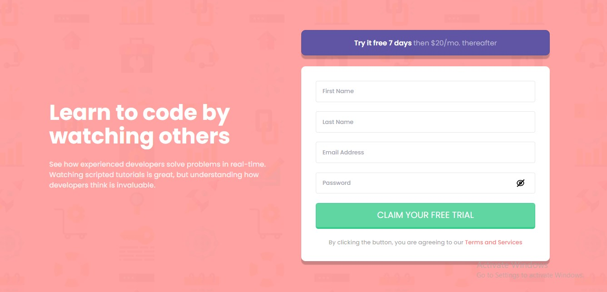

# Frontend Mentor - Intro component with sign up form solution

This is a solution to the [Intro component with sign up form challenge on Frontend Mentor](https://www.frontendmentor.io/challenges/intro-component-with-signup-form-5cf91bd49edda32581d28fd1). Frontend Mentor challenges help you improve your coding skills by building realistic projects. 

## Table of contents

- [Overview](#overview)
  - [The challenge](#the-challenge)
  - [Screenshot](#screenshot)
  - [Links](#links)
- [My process](#my-process)
  - [Built with](#built-with)
  - [What I learned](#what-i-learned)
  - [Continued development](#continued-development)
  - [Useful resources](#useful-resources)
- [Author](#author)
- [Acknowledgments](#acknowledgments)


## Overview
Hi I am Julie and this is my first JavaScript project, I was stucked in the Learning circle for a while. But I braised up to Learn more and grow. 
My first Project is a solution to the [Intro component with sign up form challenge on Frontend Mentor](https://www.frontendmentor.io/challenges/intro-component-with-signup-form-5cf91bd49edda32581d28fd1).

### The challenge

Users should be able to:

- View the optimal layout for the site depending on their device's screen size
- See hover states for all interactive elements on the page
- Receive an error message when the `form` is submitted if:
  - Any `input` field is empty. The message for this error should say *"[Field Name] cannot be empty"*
  - The email address is not formatted correctly (i.e. a correct email address should have this structure: `name@host.tld`). The message for this error should say *"Looks like this is not an email"*

### Screenshot




### Links

- Solution URL: [Solution URL](https://github.com/Jey223/intro-component-with-my-signup-form-masters.git)
- Live Site URL: [Live site URL](https://your-live-site-url.com)

## My process

### Built with

- Semantic HTML5 markup
- Tailwind
- Flexbox
- Vanilla JS
- [Styled Components](https://styled-components.com/) - For styles


### What I learned

With this project 
*I learned how to validate the inputs in forms
*I practiced the use of DOM, Functions, Conditions
*I learnt how to access the CSS from JavaScript and style my desired element. 


To see how you can add code snippets, see below:

```html
<h1>Some code I'm proud of</h1>
```
```js
function(){
    let password = document.querySelector('#password')

    if (password.type === 'password') {
        password.type = 'text';
        document.querySelector('#eye-slash').style.display = "none";
    }
    else{
        password.type = 'password';
        document.querySelector('#eye-slash').style.display = "block";
    }

    password.focus();

     console.log('🎉');
}
```


### Useful resources

- [Tailwind](https://www.tailwindcss.com) - This helped me for getting my tailwind in place. I really liked this pattern and will use it going forward.
- [JavaScript](https://www.codepen.io) - Saw some amazing ways on JavaScript

## Author

- Website - [Udoh Julie](https://www.your-site.com)
- Frontend Mentor - [@Jey223](https://www.frontendmentor.io/profile/Jey223)
- Twitter - [@juliewice3](https://www.twitter.com/juliewice3)

## Acknowledgments

Thanks to Mr Shola for helping me through my JS beginner level.
